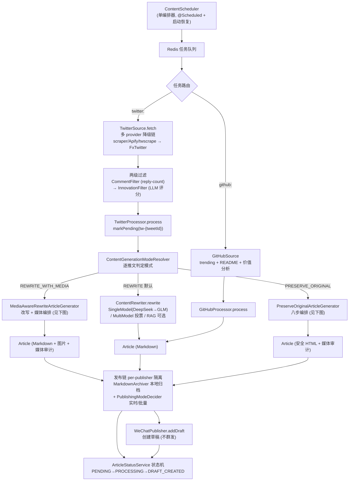
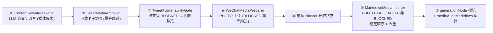
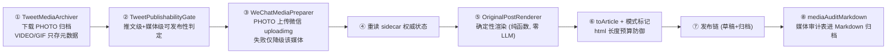

# AI Content Aggregator

> X（Twitter）与 GitHub 内容 → 智能过滤 / AI 改写（可含原帖媒体）或原帖复现 → 微信公众号草稿 + 本地 Markdown 归档

一个 Java 21 / Spring Boot 3.5 的内容聚合管道：定时抓取 X 推文与 GitHub 趋势仓库，经两级内容过滤后，按**生成模式**走三条互不污染的路径——`REWRITE`（LLM 改写）、`REWRITE_WITH_MEDIA`（LLM 改写 + 原帖图片嵌入，已批准的默认目标流程）或 `PRESERVE_ORIGINAL`（确定性复现原帖）——最终产出微信公众号**草稿**（不自动群发，人工审核后发布），并在本地保留完整的 Markdown 归档与媒体审计记录。

---

## 项目现状（2026-08-30）

**项目已到达 MVP 里程碑**：8 个 Epic、45 个已交付 story 全部完成，全量回归 **1091 tests / 0 failures / 0 errors / 0 skipped**。

| 能力 | 状态 |
|---|---|
| X 多源抓取（本地 scraper actor / Apify / twscrape / FxTwitter 降级链） | ✅ 可用 |
| 两级内容过滤（reply-count 粗筛 + LLM 创新度评分） | ✅ 可用 |
| REWRITE 主链（单模型 DeepSeek/GLM 降级、RAG 增强、多模型投票，均可配置开关） | ✅ 可用 |
| REWRITE_WITH_MEDIA 改写+媒体全链（媒体归档 → 上传 → Markdown 图片嵌入 → 草稿） | ✅ 代码完备，**真实环境验证待微信 IP 白名单放行**（见下） |
| PRESERVE_ORIGINAL 原帖复现全链（媒体归档 → 上传 → 确定性渲染 → 草稿） | ✅ 代码完备，**真实环境验证待微信 IP 白名单放行**（见下） |
| 微信草稿发布 + ArticleStatus 状态机 + 人工审核支持 | ✅ 可用 |
| GitHub 趋势内容扩展（README 抓取 + 价值分析） | ✅ 可用 |

**当前已知边界**（完整清单见 [sprint-status.yaml](_bmad-output/implementation-artifacts/sprint-status.yaml) 的 `action_items` 与 [deferred-work.md](_bmad-output/implementation-artifacts/deferred-work.md)）：

- 微信 API 出口 IP 白名单（errcode 40164）未放行期间，草稿创建与媒体上传在真实环境不可用（Markdown 归档不受影响，action item `E8-WHITELIST-E2E`）；**部署环境的出口 IP 需加入白名单**
- 媒体感知/原帖复现模式的触发依赖「推文 URL 命中 `twitter.target.urls` 配置」，按 URL 主动抓取指定推文的入口尚未接入生产链路
- sidecar（媒体状态权威源）尚余两项加固：failureReason 拆分下载/上传双字段、并发锁（当前单线程调度下不触发）

---

## 核心概念：三生成模式

理解本系统的钥匙是 `ContentGenerationMode`（`common/model/`）——系统在编排层对每条推文**显式**选择生成模式，三条路径职责严格隔离：

| | `REWRITE` | `REWRITE_WITH_MEDIA`（默认目标） | `PRESERVE_ORIGINAL` |
|---|---|---|---|
| 正文来源 | LLM 改写（Markdown） | LLM 改写（Markdown）+ 原帖图片 | 确定性渲染原帖（HTML，零 LLM） |
| 执行者 | `ContentRewriter`（Single/MultiModel） | `MediaAwareRewriteArticleGenerator` 编排 | `PreserveOriginalArticleGenerator` 编排 |
| 媒体 | 不处理（不下载/不上传） | 下载归档 → 上传微信 → Markdown 图片嵌入/降级 | 下载归档 → 上传微信 → 嵌入/降级 |
| Article.content | Markdown | Markdown（图片为 image syntax，非 raw HTML） | 已转义安全 HTML |
| 触发 | 默认 / 未命中 target urls | 命中 target urls 且 `default-mode: REWRITE_WITH_MEDIA` | 命中 target urls 且 `default-mode: PRESERVE_ORIGINAL` |

**媒体感知/原帖复现链路前置开关**（三者必须同时满足，缺一即 NonRetryable fail-fast，不静默降级）：

1. `wechat.mp.enabled=true` — gateway/preparer/converter/publisher 注册
2. `twitter.media.enabled=true` — archiver/writer/gate 注册（推文有媒体时必需）
3. `wechat.mp.original-post.enabled=true` — 模式路由入口

**降级边界**：单媒体失败（下载/上传失败、VIDEO/GIF/UNKNOWN 不支持正文图片上传）只降级该媒体并进入本地媒体审计，文章仍发布（全部降级时为纯文字草稿）；仅推文级 `publishability=BLOCKED` 阻断整篇草稿。

关键约束：**媒体感知/PRESERVE 路径绝不回退（fallback）到 LLM 改写**；`REWRITE` 既有链路零回归（配置默认值 + 逐字节回归测试双保险）；LLM 只改文字，不接触媒体 URL/状态（媒体嵌入全部由确定性代码从 sidecar 派生）。

---

## 业务主流程



### REWRITE_WITH_MEDIA 的媒体编排

改写+媒体模式复用 PRESERVE 的同一条媒体基础设施（下载归档 → gate → 上传 → sidecar 权威状态），差异只在**正文装配**：LLM 只产出文字（不接触任何媒体 URL/状态），确定性代码在改写正文之后、footer 之前追加 Markdown image syntax（``），converter 现有 Markdown path 原样渲染。



### PRESERVE_ORIGINAL 的媒体八步编排

原帖复现的媒体处理分**三个独立状态阶段**（架构不变量 AD-2），每条推文的 `media.json` sidecar 是唯一权威状态源：



媒体状态三阶段（记录在 `media.json` sidecar，原子写入）：

- **源/下载**：`downloadStatus` + `localPath`（确定性目录 `archive/media/twitter/{日期}/{tweetId}/`）
- **微信准备**：`uploadStatus` + `wechatUrl`（正文图片只用微信返回 URL，禁 X/CDN 外链）
- **可发布性**：`publishability`（单媒体失败降级，推文级 BLOCKED 才致命）

---

## 模块地图

```
com.choucj.aiaggregator
├── processor/          # 编排层：TwitterProcessor / GitHubProcessor
│                       #   ContentGenerationModeResolver (模式路由)
│                       #   MediaAwareRewriteArticleGenerator (改写+媒体编排)
│                       #   PreserveOriginalArticleGenerator (原帖复现编排)
├── source/twitter/     # X 抓取：client (多 provider) / discovery / media (下载归档) / model
├── source/github/      # GitHub 抓取：client / service / model
├── content/            # 内容处理：filter (两级过滤) / rewriter (单模型+投票) /
│                       #   rag (检索增强) / embedding (向量化)
├── publish/wechat/     # 微信发布：converter (三模式转换+Markdown 图片插入) / media (上传探针+准备器) /
│                       #   client / service / config
├── publish/storage/    # 本地归档：MarkdownArchiver / TweetMediaArchiveWriter (sidecar)
├── publish/status/     # ArticleStatus 状态机 + 人工审核 API
├── task/               # Redis 任务队列 + ContentScheduler (单编排器)
├── common/             # 跨模块：exception (三子类异常体系) / model (Article/Tweet) /
│                       #   repository (Redis) / client (LLM) / util / config
├── resilience/         # 重试 / 降级 / TokenUsageTracker 成本监控
└── monitoring/         # token 用量与成本追踪
```

技术栈：Java 21 · Spring Boot 3.5.14 · WxJava 4.6.0（微信公众号）· LangChain4j 1.16.0（DeepSeek/GLM，OpenAI 兼容协议）· Redis Cluster + RediSearch · commonmark 0.22.0

---

## 新手阅读路径

**第一层（半小时，建立心智模型）**

1. 本 README —— 三模式概念 + 三张流程图
2. [`project-context.md`](_bmad-output/project-context.md) —— 项目全部非显然规则的速查表（异常体系、日志规范、配置分层、LLM prompt 安全模式、测试规范、反模式清单）

**第二层（两小时，读懂主链代码）**

3. `ContentScheduler`（`task/scheduler/`）—— 一切调度的唯一入口（单编排器原则）
4. `TwitterProcessor.process`（`processor/`）—— 主编排 + 模式分流点
5. 三条分支各选其一深入：
   - REWRITE：`ContentRewriter` → `SingleModelRewriter`
   - REWRITE_WITH_MEDIA：`MediaAwareRewriteArticleGenerator.generate`（改写+媒体编排）
   - PRESERVE：`PreserveOriginalArticleGenerator.generate`（八步编排）
6. 发布侧：`ArticleToWxArticleConverter.convert`（模式分支）→ `WeChatPublisher.publish`

**第三层（按需查阅，不必通读）**

7. [`architecture.md`](_bmad-output/planning-artifacts/architecture.md) —— 3100+ 行架构决策**档案**，含每个 story 的 Delta 锚点（`story-X-Y-delta-...`），遇到「为什么这样设计」时按锚点查
8. [`lessons-learned.md`](_bmad-output/implementation-artifacts/lessons-learned.md) —— 11 个代码模式 + 流程教训的沉淀（改代码前必扫）
9. 运行与部署：[`LOCAL_STARTUP_GUIDE.md`](LOCAL_STARTUP_GUIDE.md) / [`docs/deployment.md`](docs/deployment.md)

**改代码前必须知道的规则**（摘自 project-context.md，完整版见原文）：

- 异常只能抛 `RetryableException` / `NonRetryableException` / `DegradationException` 三子类之一
- 强制构造器注入；`@Qualifier` 与 `@Value` boolean 场景必须手写构造器（Lombok 不传递）
- 可选依赖用 `Optional<T>` 注入，必选依赖用强制 Bean（D6 规则）
- 日志走 SLF4J 占位符，必须含业务标识符（W11），异常 message 不含响应正文（N4）
- 字符串截断一律 `TextTruncateUtil`（码点安全，防 emoji 乱码）
- schema 变更（模型字段）走 story design 阶段，不允许在 review patch 里顺手改（B8）
- 每个 story 收尾全量回归必须绿，掉测试 = 阻塞下一个 story

---

## 文档索引

| 文档 | 内容 | 何时看 |
|---|---|---|
| 本 README | 项目导览 + 业务主流程 | 入门第一站 |
| [`_bmad-output/project-context.md`](_bmad-output/project-context.md) | 非显然规则速查（技术栈/异常/日志/测试/反模式） | 写任何代码之前 |
| [`_bmad-output/planning-artifacts/architecture.md`](_bmad-output/planning-artifacts/architecture.md) | 架构决策档案 + 每 story Delta | 查「为什么这么设计」 |
| [`_bmad-output/planning-artifacts/epics.md`](_bmad-output/planning-artifacts/epics.md) / [`epics-x-media-fidelity-20260724.md`](_bmad-output/planning-artifacts/epics-x-media-fidelity-20260724.md) | 产品路线图（Epic 1-5 / 6-8） | 了解功能全貌与规划 |
| [`_bmad-output/planning-artifacts/prds/prd-design-20260528/`](_bmad-output/planning-artifacts/prds/prd-design-20260528/) | PRD + addendum | 查需求原始定义 |
| [`_bmad-output/implementation-artifacts/lessons-learned.md`](_bmad-output/implementation-artifacts/lessons-learned.md) | 代码模式 + 流程教训沉淀 | 改代码前必扫 |
| [`_bmad-output/implementation-artifacts/sprint-status.yaml`](_bmad-output/implementation-artifacts/sprint-status.yaml) | story/epic 状态 + action items 账本 | 查进度与待办 |
| [`_bmad-output/implementation-artifacts/deferred-work.md`](_bmad-output/implementation-artifacts/deferred-work.md) | 技术债务登记（含已修复标记） | 查已知债务 |
| [`_bmad-output/implementation-artifacts/retrospectives/`](_bmad-output/implementation-artifacts/retrospectives/) | 各 Epic 复盘 | 查历史经验教训 |
| [`_bmad-output/planning-artifacts/spike-*.md`](_bmad-output/planning-artifacts/) | 技术调研记录（微信媒体/Apify/Redisearch 等） | 涉及外部 API 行为时 |
| [`LOCAL_STARTUP_GUIDE.md`](LOCAL_STARTUP_GUIDE.md) / [`docs/deployment.md`](docs/deployment.md) | 本地启动 / 部署 | 运行项目时 |

---

## 常用命令

```bash
# 全量回归（基线 1091 tests，必须全绿）
./mvnw clean test

# 外部真实调用测试（微信 API 等，默认自动 skip，需显式启用）
./mvnw -Pexternal-tests test

# 本地启动（Redis Cluster 等前置见 LOCAL_STARTUP_GUIDE.md）
./mvnw spring-boot:run
```

---

_最后更新：2026-08-30（Story 9.1 REWRITE_WITH_MEDIA 三模式定调。下次更新触发：新 Epic 启动 / 主流程变更 / 模块结构调整）_
