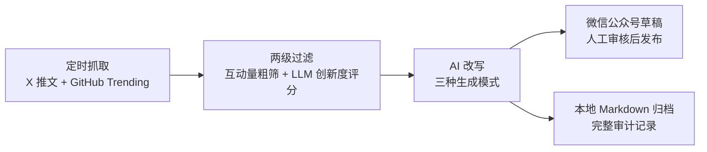

# AI Content Aggregator

> 每天自动把 X（Twitter）与 GitHub 上的优质内容，变成可直接发布的微信公众号草稿。

一个人工审核、机器跑腿的内容搬运管道：定时抓取 → 智能过滤 → AI 改写（可带原帖图片）→ 生成微信草稿，全程无需人工干预，你只需要在发布前扫一眼。

## 解决什么问题

手动运营一个技术类公众号，每天要做的事情其实高度重复：

1. 刷 X 和 GitHub Trending，找出值得写的内容
2. 判断内容质量，筛掉灌水和重复
3. 改写成中文公众号文风，排版、配图
4. 搬进公众号后台，做成草稿

这个过程每天耗费 1-2 小时，且大部分是机械劳动。本项目把整条链自动化，同时保留最关键的人工环节——**机器产出草稿，人来决定发不发**（只创建草稿，永不自动群发）。

## 工作流程



### 三种生成模式

系统按内容来源自动选择处理路径，三条路互不干扰：

| 模式 | 做什么 | 适用场景 |
|---|---|---|
| **AI 改写**（默认） | LLM 重写为公众号文风 | 普通资讯类推文 |
| **AI 改写 + 原帖图片** | 改写文字，并把原帖图片下载后嵌入正文 | 图文并茂的推文 |
| **原帖复现** | 不经 LLM，逐字保留原帖内容与图片 | 需要原汁原味呈现的内容 |

媒体处理有完整的降级策略：单张图片下载或上传失败只影响那张图（自动降级为纯文字），不会拖垮整篇文章；所有媒体操作留有审计记录，出问题可追溯。

## 核心特性

- **多源抓取，自带降级**：X 内容支持本地 scraper / Apify / twscrape 多通道，一层失败自动切下一层，保证抓取可用性
- **省钱的内容过滤**：先用互动量等廉价信号粗筛，再让 LLM 给创新度评分，避免对垃圾内容浪费 token
- **可插拔的 AI 改写**：支持 DeepSeek / GLM 等国产大模型（OpenAI 兼容协议），主模型失败自动切备用模型；可选多模型投票与 RAG 检索增强，均由配置开关控制
- **成本可见可控**：token 用量与费用按月追踪，达到预算阈值自动暂停处理，月度账单一目了然
- **可观测**：内置 Prometheus 指标端点与 Grafana 面板（队列积压、任务结果、JVM/容器资源），配套最小告警集，调度漏跑、队列积压、成本超支第一时间知道
- **可靠性优先**：Redis 持久化任务队列，应用重启自动恢复断点；任何单篇内容失败不影响后续处理

## 技术栈

| 层次 | 选型 |
|---|---|
| 语言 / 框架 | Java 21 · Spring Boot 3.5 |
| AI 编排 | LangChain4j（DeepSeek / GLM，OpenAI 兼容协议） |
| 内容平台 | WxJava（微信公众号草稿箱 API） |
| 存储 | Redis（任务队列 + 嵌入向量 RediSearch） |
| 观测 | Micrometer + Prometheus + Grafana + cAdvisor（单机 Docker 观测平面） |
| 测试 | JUnit 5 + Mockito，1100+ 自动化测试，外部 API 调用默认隔离 |

## 快速开始

```bash
# 本地启动（Redis Cluster 等前置配置见 LOCAL_STARTUP_GUIDE.md）
./mvnw spring-boot:run

# 全量回归测试
./mvnw clean test
```

需要配置：`application.yml`（主配置，参考 `application.example.yml`）、`api-keys.yml`（LLM / X / 微信凭据，不入库）。本地日志同时输出到控制台和 `logs/ai-content-aggregator.log`，按日期或 20 MB 滚动；生产覆盖配置为 `application-prod.yml`，自动化测试配置位于 `src/test/resources/application.yml`。

## 当前状态

MVP 已交付并在真实环境运行：内容抓取、过滤、改写、媒体嵌入、微信草稿创建全链可用。已知边界：微信 API 出口 IP 白名单未放行的部署环境无法创建草稿（本地 Markdown 归档不受影响）。

---

_最后更新：2026-09-13_
